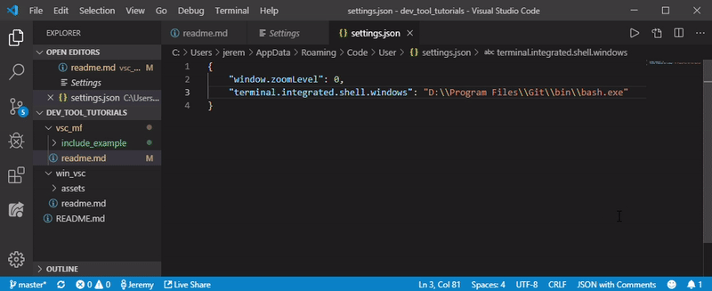

# Visual Studio Code: Multiple File Compilation

## Problem
Unlike some IDE softwares (remember, vscode is not a full ide) Visual Studio
Code doesn't have any extremely clear methods to compile multiple files without
the user doing so manually. We can address this issue in a few different ways
which will be detailed below.

## Requirements
The following is assumed about your environment:
* You are using Visual Studio Code
* You have the Code Runner extension for vscode installed
    * only needed for one of the methods below
* You have G++ installed and in your PATH

If any of the above assumptions are **not** true of your environment and you are
on Windows, [follow this tutorial.](https://github.com/jeremyglebe/dev_tool_tutorials/tree/master/win_vsc)

## 3 Methods of Multiple File Compilation

### Use the integrated terminal

### Code Runner's Executor Map
This method is simple. When you run something using Code Runner, you'll notice
that is shows a command being executed in your output. That's because code
runner is really just automatically executing some commands for you. We can
configure what command it uses in something called the *executor map*. Don't
worry, you don't have to know command line for this one, just use the command
I've provided.
* Open your project's folder in Visual Studio Code
* Click `file` in the top left
* Select `preferences`, then `settings` in the drop down menu
    * This should open a new tab within vscode
* In the search bar, type `executor map`
    * You should see `Code-runner: Executor Map. Set the executor of each language.`
* Right below it, click `Edit in settings.json`
* Add the following after any existing settings, and make sure to include a comma
    * ```
        "code-runner.executorMap": {
            "cpp": "cd $dir && g++ *.cpp -o $fileNameWithoutExt && $dir$fileNameWithoutExt"
        }
    ```
* If there is already a line containing `code-runner.executorMap`, or if it autocompletes a bunch of lines all at once, its okay! Just find the line that says `cpp` and change it to the command written above.


### Preprocessor Directive: 'include'