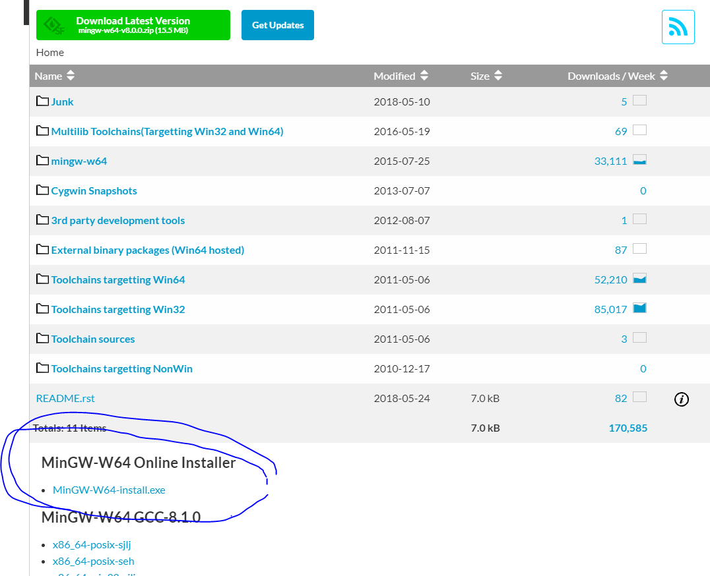
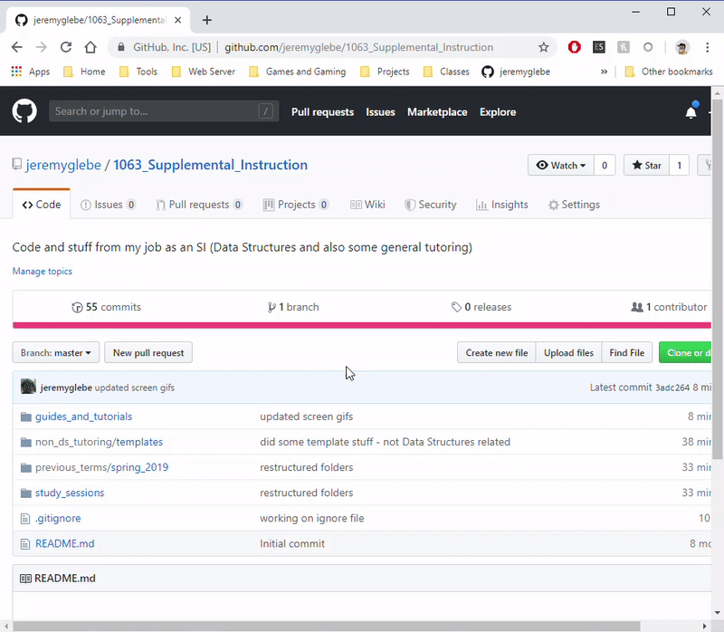
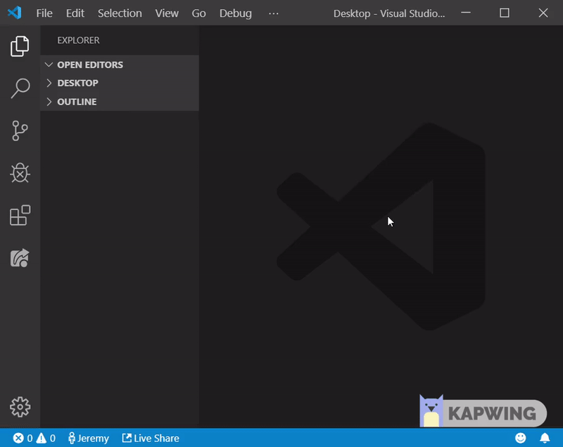
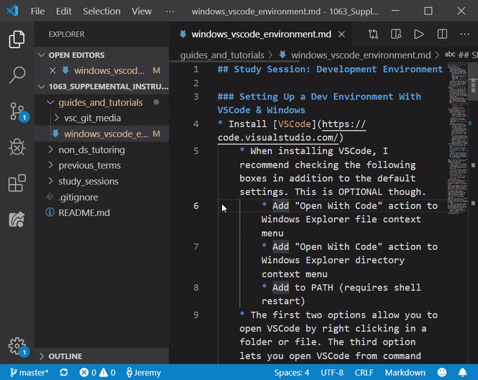
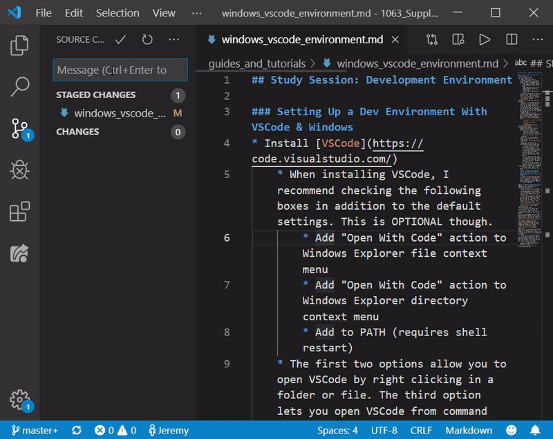
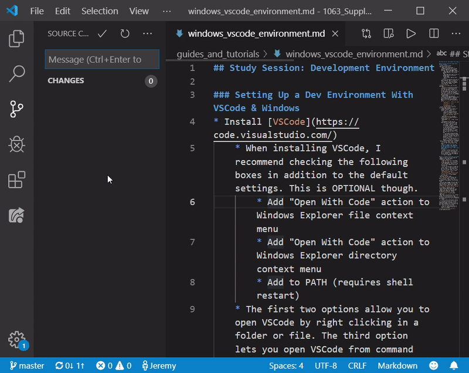

# C++ Dev Environment With VSCode & Windows

## Subject
Setting up a development environment in Windows can be difficult. Still, there
are advantages to setting up your own dev envrionment v. installing overbloated
IDEs. In this tutorial, we will discuss how to set up a general dev-environment
for C++ on Windows using Visual Studio Code. We will be using the G++ compiler.
As an added bonus, we will go over installing Git and managing your GitHub repo
through vscode.

## Requirements
The following is assumed about your environment:
* You are on a Windows machine compatible with VSCode, Git, and MinGW
* You are familiar with downloading files and navigating windows directories

## Install [VSCode](https://code.visualstudio.com/)
* When installing VSCode, I recommend checking the following boxes in addition to the default settings. This is OPTIONAL though.
    * Add "Open With Code" action to Windows Explorer file context menu
    * Add "Open With Code" action to Windows Explorer directory context menu
    * Add to PATH (requires shell restart)
* The first two options allow you to open VSCode by right clicking in a folder or file. The third option lets you open VSCode from command line using the command `code [folder_path]`.

## Install [MinGW-W64](https://sourceforge.net/projects/mingw-w64/files/)
MinGW is a package of GNU elements for developers on Windows. If that last
sentence didn't make sense, don't worry its not important. What *is* important
is that MinGW comes with the option to install the G++ compiler. This is the
compiler of choice for many c++ developers and the one we will be using.
(Note: MinGW-W64 is a newer, actively maintained version of MinGW. This
tutorial was originally written for MinGW but MinGW-W64 has wider compatibility
and easier installation.)
* Follow the above MinGW-W64 link, then scroll down the page until you find "MinGW-W64 Online Installer". Click the installer link.

* Download and run the installer.
* Under `Architecture` select `x86_64`
* NOTE which directory MinGW is installed to, it should contain a folder called `mingw64\bin\`
* Add MinGW's `bin\` folder to your `PATH`
* On Windows 10, PATH can be modified by following these steps
    1. In Search, search for and then select: Edit the system environment variables
    2. Click Environment Variables. In the section System Variables, find the PATH environment variable and select it. Click Edit. If the PATH environment variable does not exist, click New.
    3. In the Edit System Variable (or New System Variable) window, click "new" to add a new line to the PATH, then enter the path of MinGW's bin folder (C:\\\wherever\i\installed\it\mingw64\bin\\). Click OK. Close all remaining windows by clicking OK.

## Add extension "Code Runner" to VSCode
The Code Runner extension is a quick and convienent method of executing your
code inside of VSCode. It works for numerous languages, including c++. Of
course, you have MinGW installed and G++, so you don't *need* code runner. But
I highly recommend it.
* Click the `extensions` button on the left (it looks like 4 cubes with one drifting away)
* Search for and select Code Runner from the list
* Click `install` near the top of the page
* To run your code, right click while in the cpp file and select "Run Code"
* If you wish to compile multiple files and not simply execute the one you have open, [see this tutorial](https://github.com/jeremyglebe/dev_tool_tutorials/tree/master/vsc_mf)
* To configure additional settings, you'll need to go to your preferences 
    * Open your project's folder in Visual Studio Code
    * Click `file` in the top left
    * Select `preferences`, then `settings` in the drop down menu
        * This should open a new tab within vscode
    * In the search bar, type in the setting you wish to change
* You may want to configure these settings (optional):
    * `Code-runner: Run in Terminal` check this box to allow for interaction with your program. By default it goes to a non-interactive output which can block things like `cin` from getting keyboard input
    * `Code-runner: Save All Files Before Run` check this box to automatically make sure your files are saved when clicking `Run Code`
    * `Code-runner: File Directory As Cwd` check this box to automatically compile from the directory your file is in. This will prevent *a lot* of errors. Otherwise it might say that the file you're trying to compile can't be found (if you're in a folder with multiple projects inside)

## Install [Git](https://git-scm.com/downloads)
Git is a useful tool for project management, version control, and
collaboration. Regardless of whether you intend to use websites like GitHub,
Git can still be a useful tool for your development environment. It also comes
with a Bash terminal which has many features not present in Windows Command
Line. Unless you are absolutely sure you don't want to use Git, and have an
alternative set up, you should follow these steps.
* Once Git is installed, we need to configure it to know who you are (Git logs who makes changes to a project). As far as I can tell, it is unavoidable that you will have to do this bit through the command line. Don't worry, just two commands and then everything else can be done through VSCode.
* Open Git Bash and type the following two commands. Replace John Doe's name and email (inside the quotes) with your name and email. Make sure to include the quotation marks!
    * `git config --global user.name "John Doe"`
    * `git config --global user.email "johndoe1955@hotmail.com"`

## How to Manage GitHub Repo with VSCode
This is an extra section for developers who want to use VSCode to manage their
code repository on GitHub. I assume that you 1) have a GitHub account and
2) have created and can navigate to your repository. Everything else should be
covered below.
* Make sure you ran the two required commands in the steps above
* Clone your repository
    * Copy the clone link from GitHub
    
    * Hit CTRL+SHIFT+P, search for and use the clone command. Paste your cloning link.
    * It will ask you where to make the clone, select a folder you wish to put the repo in. (The repo itself will be in a new folder, so if you choose `desktop`, it will create `desktop/your_repo_name`)
    
* Now open the new folder (`your_repo_name`) with VSCode. We'll work from this folder from now on.
* Click around, create files, work on assignments, and whatever else you want to do.
* Once you have changes that you need to save and send to GitHub, click on the "Source Control" tab and the "Stage All Changes" button (which looks like a '+')

* Now click the check mark that says "Commit" and type in an appropriate message describing your changes

* Now look at the bottom of your VSCode window. You should see two arrows forming a circle and next to them an up arrow and a down arrow (each accompanied by a number)
    * This is the "synchronize" button.
* Click the synchronize button and you will automatically push all of your committed changes to GitHub as well as pull down anything you're missing from your local version of the repo.
    * The first time you do this, a window will pop up asking you to sign in to GitHub.

